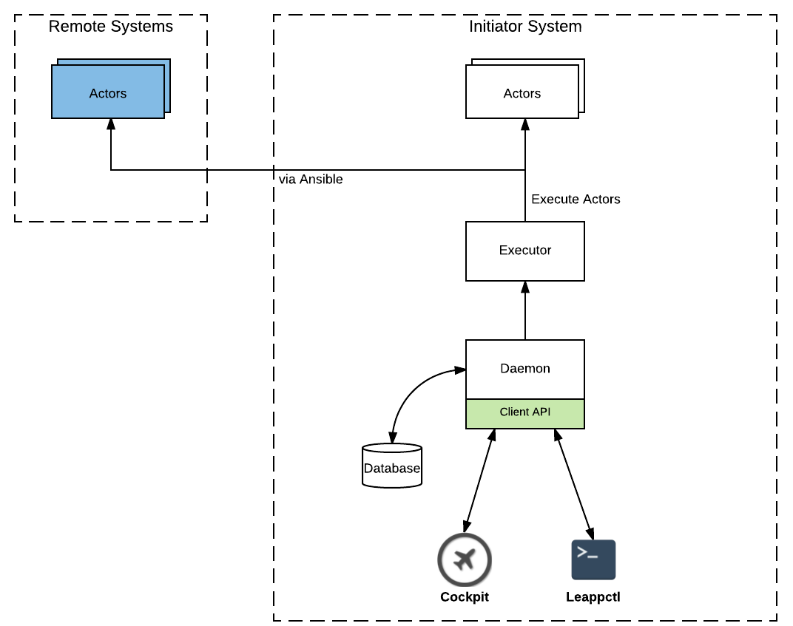

{:width="200px"}

# Welcome to LeApp                                                         
                                                                                                                            
## Architecture overview                                                                                                
                                                                                                                            
### Big picture                                                                                                                                                                                                                                    

                                                                                                                            
### Execution flow

                                                                                                                                                                                                                                                      
#### Legend: 
1. **Client**
   Client can be web UI (cockpit plugin) or shell client, both communicate with Daemon over HTTP protocol. 
You can execute specific commands (with custom options) and then read the output.

   By running specific command you're running specific workflow.
You can find explanation what is workflow at point **4. Executor**

2. **Daemon**
   A bridge between Client and Executor, heart of LeApp.

   Because of daemon-centric architecture we are able to use async calls easier than before and data exchange flow is much simpler.
	
   It exposes HTTP endpoints, saves information in Database, runs Executor and send back output to the clients.

3. **Database**
   Simple SQLite3 database, it keeps information about executed commands and store output from them.

   By keeping information in database we are able to build migrations history.
Those kind of information are not only useful for end-users, it is also useful for contributors to analyze migration process and improve it in the future.

4. **Executor**
   Daemon passes specific workflow to Executor and then Executor is able to run bunch of actors contained in one workflow.

   What is workflow? Think about it as step-by-step recipe to achieve desired result.
For example if you want to build a house you might have workflow like that: 
	1. build foundations
	2. build walls 
	3. build roof

   So right now switch your mind to OS context, what kind of workflow do you need to move LAMP stack to macro-container or micro-containers environment?
	
   Tip - think about:
	1. OS configuration
	2. Apps dependencies
	2. Apps config files
	3. Network (open ports, firewall rules etc.)
	4. Data

5. **Actors**
   Consider actor as a definiton of specific action, it can be bash, python script or even ansible-playbook.
For example if you want to discover all open ports on some host, first you have to write YAML file which describes information about your actor and then you can write python script which scanns ports.
To get deep knowledge how to create your own actors visit: https://github.com/leapp-to/leapp-actors

   When you have more actors like that, you're able to create workflow.

### Execution flow example
In progress...

